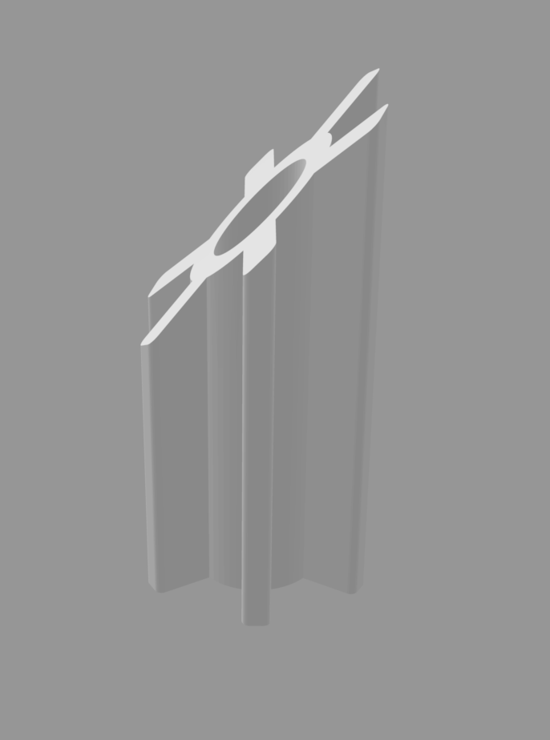

# 🔧 Element Mocowania Lampy Owiewki — Yamaha YZF R125

> **Projekt: Inżynieria odwrotna · Druk 3D · Autodesk Fusion 360**  
> Zaprojektowany zamiennik uchwytu mocującego lampę owiewki (czaszy) motocykla Yamaha YZF R125.

---

## 📋 Opis projektu

Element mocowania lampy do owiewki/czaszy motocykla **Yamaha YZF R125**, zaprojektowany metodą **inżynierii odwrotnej** na podstawie oryginalnego elementu, który zachował się w dobrym stanie. Wymodelowany zamiennik przeznaczony jest do przyklejenia w miejscu, z którego odpadł uszkodzony oryginał.

Projekt rozwiązuje powszechny problem kruchości plastikowych uchwytów owiewek — zamiast kupować nową owiewkę lub całą czaszę, wystarczy wydrukować i dokleić odtworzony element.

---

## 🖼️ Podgląd modelu

### Model elementu mocowania lampy



*Model 3D elementu mocowania lampy owiewki Yamaha YZF R125*

---

## 🔬 Metodologia

### 1. Wymiarowanie oryginału
- Pomiar zachowanego, nieuszkodzonego elementu mocowania przy użyciu suwmiarki
- Odwzorowanie geometrii: kształt, otwory montażowe, grubość ścianki, kąty

### 2. Modelowanie CAD (Autodesk Fusion 360)
- Odtworzenie geometrii na podstawie wymiarów rzeczywistego elementu
- Zachowanie tolerancji dopasowania do gniazda w owiewce
- Uwzględnienie geometrii powierzchni klejenia

---

## 📁 Struktura repozytorium

```
.
├── images/
│   └── element_mocowania.png                  
├── Element_mocowania_yamaha_yzfr125.stl        # Plik do druku 3D
├── Element_mocowania_yamaha_yzf_r125.obj       # Model do wizualizacji
├── Element_mocowania_yamaha_yzf_r125.mtl       # Materiały dla pliku OBJ
└── README.md
```

---

## 🖨️ Druk 3D — zalecenia

| Parametr | Zalecenie |
|----------|-----------|
| **Materiał** | PETG (odporność na wibracje i temperaturę) |
| **Wypełnienie** | min. 40% |
| **Grubość ścianki** | min. 3 obrysy |
| **Orientacja** | powierzchnia klejenia równolegle do stołu |

> ⚠️ Unikaj PLA — w warunkach motocyklowych (ciepło silnika, wibracje) może być zbyt kruchy.

---

## 🔩 Montaż

1. Wydrukować element zgodnie z zaleceniami powyżej
2. Dopasować do gniazda w owiewce
3. Powierzchnie odtłuścić izopropanolem
4. Przykleić dwuskładnikowym klejem epoksydowym lub klejem do plastiku (np. Plastic Padding)
5. Odczekać czas utwardzania przed montażem owiewki

---

## 🛠️ Użyte narzędzia

| Narzędzie | Zastosowanie |
|-----------|-------------|
| **Suwmiarka** | Wymiarowanie oryginalnego elementu |
| **Autodesk Fusion 360** | Modelowanie CAD na podstawie wymiarów |
| **Drukarka 3D** | Wydruk gotowego zamiennika |

---


*Projekt stworzony z potrzeby — zamiast wymieniać całą owiewkę, wystarczył pomiar, Fusion i drukarka.*
